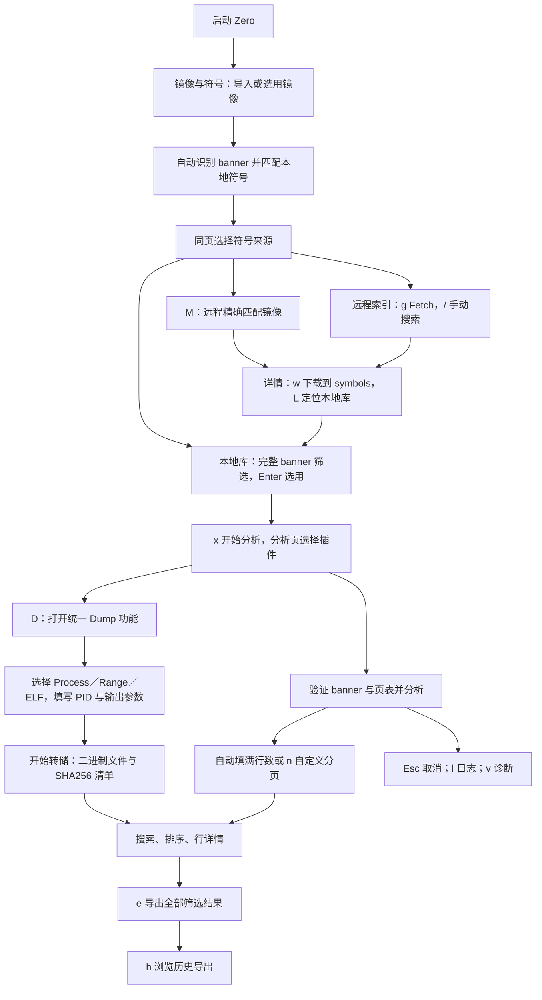

# Zero · Rust 原生终端取证

本地 Linux x86_64／ARM64 和 Windows 10/11 x64 内存取证工具，使用 Rust 2024、Ratatui 和 Crossterm。支持 RAW、LiME 及其 gzip 镜像，读取 JSON、JSON.XZ 或 ZIP 内的 ISF，取证引擎无需 Python、Node 或 HTTP 服务；在线符号下载使用系统 `curl`。

## MCP 与 Agent skill

项目提供原生 stdio MCP 服务 `zero-mcp`，直接调用 Rust 取证 API。项目级 [Codex 配置](.codex/config.toml)、[Claude Code 配置](.mcp.json) 和 [Zero skill](.agents/skills/zero-forensics/SKILL.md) 已就绪。先在项目目录执行 `cargo build --release --locked --bin zero-mcp`；受信任的 Codex 项目配置或 Claude Code 项目配置加载后，重新打开会话即可使用。配置中的绝对路径指向当前项目位置；移动项目后需同时更新两份配置和 skill 中的根路径。首次通过配置启动时也会自动编译，可能需要一段时间。

MCP 工具包括 `zero_plugins`、`zero_symbols`、`zero_analyze`、`zero_dump` 和 `zero_cache_list`。`zero_analyze` 直接返回分页 JSON，`output` 可另存全部结果为 JSON／CSV；`zero_dump` 要求明确的 PID、目标目录和清单路径。相对路径以项目根目录为基准，`offline: true` 禁止符号网络请求。镜像不上传；在线模式仅按完整 banner 查询和下载符号。MCP 工具执行可能耗时较长，客户端工具调用超时建议至少 300 秒。

无需客户端时可直接测试协议：

```sh
printf '%s\n' '{"jsonrpc":"2.0","id":1,"method":"initialize","params":{"protocolVersion":"2025-06-18","capabilities":{},"clientInfo":{"name":"test","version":"1"}}}' '{"jsonrpc":"2.0","id":2,"method":"tools/list"}' | ZERO_ROOT="$PWD" ./target/release/zero-mcp
```

```sh
cargo build --release --locked
./target/release/zero --image symbols/linux-sample-1.bin.gz --symbols images/linux.zip
# 或安装至 Cargo bin 目录
cargo install --path . --locked
# 安装后可直接运行 zero、zero-mcp；zero-tui 仍作为兼容命令保留
```

不带参数启动时，镜像与符号保持未选择状态，不恢复上次分析对象，也不自动读取镜像；只有显式 `--image`／`--symbols` 或在界面中选用后才加载。符号路径可以是文件或目录；只有完整 `linux_banner` 匹配的 ISF 才能进入分析。多候选时必须手动选择。默认先匹配本地符号和下载缓存，缺少时按完整 banner 从 [Abyss-W4tcher/volatility3-symbols](https://github.com/Abyss-W4tcher/volatility3-symbols) 下载架构与完整 banner 匹配的 ISF；镜像始终在本地，只向仓库请求索引和符号文件。`--offline` 完全禁止网络请求。

项目管理使用顶部两个 Tab：**分析、镜像与符号**。`F2`／`F3` 或 Ctrl+←/→ 切换页面，鼠标也可点击标签。合并页集中展示镜像和符号列表，符号区可点击 **本地库／远程索引** 或按 `t` 切换来源。100 列起左右排列镜像与符号；窗口足够高时下方显示详情，更窄时上下排列；高度不足 20 行时显示当前操作区域，通过区域标签或 Tab 切换。各列表独立保存搜索和滚动位置。顶部显示明确选用的镜像、内核及符号；高亮行与“●已选用”标记分别表示浏览对象和分析对象。

- **镜像**：列出配置的 `images/` 和已导入镜像。`a` 导入，Enter 选用后自动识别完整 banner 并匹配本地符号，停留在合并页。切换镜像会清除旧匹配和旧符号选择，不自动选用匹配候选。
- **本地符号**：集中管理 JSON／JSON.XZ／ZIP、已导入文件和下载符号。`a` 导入，`m` 匹配当前选用镜像，`z` 切换匹配结果／全部文件，Enter 选用符号，`d` 查看 banner、SHA256、架构和来源。选用后仍留在合并页，`x` 开始分析并进入分析页；执行时验证镜像与页表，多候选需要明确选择。
- **远程符号**：`M` 按当前选用镜像精确匹配；`g` 获取完整仓库索引，`/` 搜索，可输入多个关键词，例如 `Debian 3.2.0-4-amd64`。点击条目或按 Enter 打开详情，显示完整 banner、仓库路径、URL、下载状态和保存位置。点击 **下载到 symbols** 或按 `w` 一键保存；无镜像也可下载。索引搜索与精确匹配的下载都只保存，不自动选用、切换来源或启动分析。下载完成后在详情中点击 **本地库定位**／按 `L`，再选用符号。
- 校验通过的下载保存到配置的符号目录，默认 `symbols/`；配置指向单个符号文件时保存到项目 `symbols/`。使用内容摘要命名并保留来源记录，本地库隐藏对应的重复缓存；缓存清理后仍可复用本地副本。详情显示进度和错误，可取消、重试。
- `r` 刷新当前列表，保留查询和远程匹配模式；`o` 切换在线／离线。离线时仅使用缓存和已保存符号，没有缓存时提示开启网络。任务中可浏览列表、切换页面；选用、导入、匹配等冲突操作暂时禁用。
- Tab／Shift+Tab 切换镜像、符号及可见详情区域；方向键、PgUp/PgDn、Home/End 导航，`/` 搜索当前列表，`d` 完整详情。Delete 将本地资产移出清单并保留原文件。Esc 关闭弹窗，无弹窗时取消任务；远程详情中 `c` 取消下载。Ctrl+P／`?` 打开当前区域的命令面板。

旧 F9–F12 管理页面入口已移除；F2/F3 统一用于顶层页面切换。分析页使用 `i/y` 选择镜像／符号，Dump 弹窗中的 F2/F3/F4 继续切换转储模式。资产清单和选择记录保存在 `.zero/rust/workspace.json`，重启保留清单但不自动选用旧分析对象。

操作流程：



仓库现已只保留 Rust 源码、文档、验收脚本与测试镜像／符号表；旧 Python／Web 项目、环境、凭据、规则、会话、历史结果、日志与迁移备份已按要求移除。Rust 运行数据会重新创建于 `.zero/rust/`，导出默认放入 `exports/`。测试符号为 `images/linux.zip` 与 `symbols/kali-6.8.11-arm64.json.xz`；原始镜像保持只读。

目录、分页与任务状态：

- 默认镜像目录 `images/`、符号目录 `symbols/`、导出目录 `exports/`，启动时创建。按 `,` 配置默认浏览目录；按 `n` 自定每页行数（1–10000），输入 `auto` 或 `0` 自动填满当前结果区域，随窗口高度调整。默认使用自动行数，旧版固定行数设置首次迁移为自动，此后保留用户选择；终端变小时实际每页行数不超过可见高度，避免翻页跳过看不到的行；配置持久化到 `.zero/rust/settings.json`。外部文件导入只登记路径，不复制或修改镜像。
- 分析页 `i`／`y`／合并页 `a` 或点击顶部路径打开配置目录的文件弹窗，列出该目录实际文件与子目录，包括 ZIP 和其他普通文件；不会汇总整个项目，也没有指定文件的特殊入口。IMG／ISF 标记辅助识别类型，选用已识别文件时按类型导入；↑↓ 选择，Enter／→ 打开目录或文件，←／Backspace 浏览上级，Tab 在镜像／符号目录间切换，`w` 返回当前类型的配置目录，Space 选用符号／配置目录，`p` 手动输入路径。选用镜像后自动读取 banner，分析页顶部显示内核候选；完整符号及页表验证仍在执行分析时完成。
- 合并页 `m`／`M` 始终匹配当前选用镜像，列表里高亮另一个镜像不会改变匹配对象。完整 banner 匹配结果绑定镜像与符号文件元数据，未变化时复用，切换镜像后清除；选择符号保留已识别 banner。
- 远程 `g` 获取完整索引，`M` 单独列出当前镜像的精确匹配，`r` 刷新当前视图。离线时读取缓存，没有完整匹配时显示 0 个候选，不按内核版本猜测符号。
- `[`／`]` 或结果区域 PgUp／PgDn 翻页，表头显示页码；短列按内容收紧，长字段限制显示宽度后可横向滚动或查看详情。排序使用完整字段，数字／十六进制按数值排序，其他内容按字符串排序。
- `h` 打开导出记录目录，浏览历史 CSV／JSON；它是独立功能，已从插件菜单移出。历史内容使用相同筛选、排序、详情和分页功能；`e` 导出全部筛选结果，不受当前页影响。
- 内容表格上方固定显示搜索框，可点击或按 `/` 编辑；长查询保持光标可见，并可点击确认／撤销。
- 底部用一行状态／进度和一行随页面与焦点变化的操作按钮展示：插件区提供运行和插件搜索，内容区提供排序、导出、行数和翻页，详情区提供滚动，本地库提供导入／选用，远程索引提供获取索引／详情／下载。窄窗口优先保留 `?更多`，命令面板也按当前页面和区域筛选，快捷按钮不再被截成半个；`l` 查看最近 200 条任务消息和完成／失败记录。读取总量已知时显示百分比进度条，总量未知时显示处理状态、已用时间和取消入口。
- 远程下载缓存使用“可读名称＋仓库完整路径的 SHA256 后缀”，兼容旧缓存；保存到本地库的文件使用 ISF 内容 SHA256 后缀。同名镜像的清单显示不同路径标识；识别记录区分规范路径和文件元数据，分析缓存仍绑定镜像内容 SHA256、ISF SHA256 和引擎版本。不同内容的同名镜像不会共用结果，相同内核的符号可以安全共享；不使用时间或 MD5 来判断缓存有效性。

批处理与导出：

```sh
zero analyze --image symbols/linux-sample-1.bin.gz --symbols images/linux.zip \
  --plugin pslist --output processes.json
zero analyze --image symbols/linux-sample-1.bin.gz --symbols images/linux.zip \
  --plugin lsmod --output modules.csv
# Recover in-memory Bash history
zero analyze --image symbols/linux-sample-1.bin.gz --symbols images/linux.zip \
  --plugin history --output history.json
# Dump only PID 1; binaries and manifest have separate output parameters
zero dump --image symbols/linux-sample-1.bin.gz --symbols images/linux.zip \
  --mode process --pid 1 --dump-dir exports/dumps --output dump-index.csv
# Dump an explicit user virtual address range (obtain the range with maps first)
zero dump --image symbols/linux-sample-1.bin.gz --symbols images/linux.zip \
  --mode range --pid 1 --start 0x608000 --end 0x609000 \
  --dump-dir exports/dumps --output range.json
# Export ELF-header-containing mappings of one process
zero dump --image symbols/linux-sample-1.bin.gz --symbols images/linux.zip \
  --mode elf --pid 1 --dump-dir exports/dumps --output elf-index.csv
```

TUI 插件列表只列分析插件，转储统一放在 `dump` 功能中，用 `D` 打开。CLI 推荐使用 `dump --mode process|range|elf`，必填 PID、转储目录与清单输出；兼容原 `analyze --plugin procdump|memdump|elfdump` 调用。

Linux 的 `--plugin` 支持 `pslist`、`pstree`、`lsmod`、`psaux`、`envars`、`maps`、`lsof`、`sockstat`、`banners`、`pwd`、`pscred`、`threads`、`mountinfo`、`check_creds`、`dmesg`、`systeminfo`、`elfs`、`bash`、`malfind`、`psxview`、`check_modules`、`check_syscall`、`psstate`、`capabilities`、`fdsummary`、`history`、`procdump`、`memdump`、`elfdump`、`iomem`、`ioports`、`ptrace`、`keyboard_notifiers`，共 33 个。进程字段为 PID、TGID、PPID、Name、Address，PID 0 不进入结果；模块字段为 Name、Base、Size，大小以字节计。`pstree` 导出同样的完整进程字段，PPID 表达父子关系，TUI 显示可展开树。地址是完整虚拟地址，模块 Base 是 `module_core` / `core_layout.base`，Size 是整个核心内存区域大小。

新增分析字段与范围：

| 插件 | 字段 |
| --- | --- |
| psaux | PID、Name、CommandLine、Status |
| envars | PID、Name、Key、Value |
| maps | PID、Name、Start、End、Permissions、FileOffset、Path |
| lsof | PID、Name、FD、Type、Inode、Path、FileAddress |
| sockstat | PID、Name、FD、Family、Type、Protocol、LocalEndpoint、RemoteEndpoint、State、SocketAddress |
| banners | Offset（物理地址）、Banner；无需 ISF |
| pwd | PID、Name、Root（全局路径）、CWD（相对进程根） |
| pscred | PID、Name、UID、GID、EUID、EGID、SUID、SGID、FSUID、FSGID、CredAddress |
| threads | PID、Name、TID、ThreadName、Address |
| mountinfo | PID、Name、MountID、ParentID、Device、MountPoint、FileSystem、Flags、Address |
| check_creds | CredAddress、PIDs、Names、UID、EUID |
| dmesg | Index、Message（现代日志的 Index 为 seq） |
| systeminfo | Key、Value；镜像／符号摘要、架构、页大小、重定位、验证状态 |
| elfs | PID、Name、Start、End、Type、Entry、Path |
| bash | PID、Name、Timestamp、Command、Address |
| malfind | PID、Name、Start、End、Permissions、Path、Reason、Preview |
| psxview | PID、Name、Address、Tasks、PIDIndex、ThreadGroup、Reason |
| check_modules | Name、Address、Start、End、ModuleList、Sysfs、Reason |
| check_syscall | Table、Index、Target、Symbol、Owner、Reason |
| psstate | PID、Name、State、ExitState、Flags |
| capabilities | PID、Name、Inheritable、Permitted、Effective、Bounding、CredAddress |
| fdsummary | PID、Name、Total、Regular、Sockets、Pipes |
| history | PID、Shell、Timestamp、Command、Address |
| iomem / ioports | Name、Start、End、Depth、Flags、Address |
| ptrace | Process、PID、TID、TracerTID、TraceeTID、Flags |
| keyboard_notifiers | Address（回调）、Module、Symbol、Priority、NotifierAddress |
| procdump / memdump / elfdump | PID、Name、Start、End、Size、SHA256、File |

`psstate` 输出 ISF 中的进程状态、退出状态及标志原始 64 位十六进制值，不套用其他内核版本的位定义。`capabilities` 读取凭据中的四种 capability 位掩码；`fdsummary` 按进程汇总 FD，包含零 FD 进程，重复引用分别计数，其他文件类型只计入 Total。FD 读取或路径解析失败会保留诊断、标记部分结果。

新增三个与 Volatility 3 对齐的 Rust 原生分析，以及一个资源树扩展：

| Zero | Volatility 对应功能 | 解析范围 |
| --- | --- | --- |
| `iomem` | [Volatility 3 linux.iomem](https://volatility3.readthedocs.io/en/latest/volatility3.plugins.linux.iomem.html) | 从 `iomem_resource` 遍历资源树，类似 `/proc/iomem` |
| `ioports` | 本项目扩展（复用 `iomem` 的资源树机制，无官方同名插件） | 从 `ioport_resource` 遍历 I/O 端口资源树；ARM64 可能只有少量根资源 |
| `ptrace` | [Volatility 3 linux.ptrace](https://volatility3.readthedocs.io/en/latest/volatility3.plugins.linux.ptrace.html) | 包含非组长线程，输出 tracer 与 tracee；正常无跟踪关系为空表 |
| `keyboard_notifiers` | [Volatility 3 linux.malware.keyboard_notifiers](https://volatility3.readthedocs.io/en/latest/volatility3.plugins.linux.malware.keyboard_notifiers.html) | 遍历键盘通知链，显示回调及已知内核／已加载模块归属 |

这些是本地 ISF 驱动的实现，不执行 Volatility Python 插件。资源 Start／End 是**物理资源地址或端口号**，End 包含边界；Address 为结构的虚拟地址，Depth 从根的 0 开始，Flags 保留原始掩码。资源树限制 100 万项、1024 层，字符串限制 4096 字节；循环、缺页、倒置范围和达到上限均标记部分结果，保留可读分支。`ptrace` 的 PID 是 TGID，TID 为线程 ID，未关联一端显示 `[none]`，Flags 输出原始掩码，便于跨内核核对，不将 tracer 误用 `real_parent` 解析。`keyboard_notifiers` 的 Priority 为有符号整数；Symbol 仅根据已知内核代码范围内的 ISF 符号定位，模块内无 ISF 函数名时显示 `[unknown]`，不猜测相邻内核符号。这里只检查已加载模块链表，不进行隐藏模块扫描，回调出现本身不表示恶意。无通知回调为空表；缺少必要结构／符号会明确报告不支持。

CLI 示例（TUI 按 `p` 搜索同名插件）：

```sh
zero --offline analyze --image symbols/linux-sample-1.bin.gz --symbols images/linux.zip \
  --plugin iomem --output exports/iomem.json
zero --offline analyze --image images/kali.raw --symbols symbols/kali-6.8.11-arm64.json.xz \
  --plugin ptrace --output exports/ptrace.csv
```

本地全字段核对：Debian `iomem=116`、`ioports=65`；Kali ARM64 `iomem=50`、`ioports=2`。两个样本 `ptrace=0`、`keyboard_notifiers=0`，均为正常空表；Kali ptrace 保留原有父进程缺失提示。实际 tracer／tracee、回调归属与负优先级另有合成测试覆盖。四个结果的完整字段已由 `tests/reference/debian.py` 独立只读解析核对，并写入两套验收基线；`make acceptance` 检查行摘要、诊断、导出及缓存行为。独立复核时给该脚本传入 `--plugins iomem,ioports,ptrace,keyboard_notifiers`，其余镜像／符号／结果前缀参数同下文。

`history` 从内存中的 Bash 历史结构恢复带时间戳记录，并从已验证记录邻接的指针数组恢复部分无时间戳命令；不读取磁盘历史文件。`bash` 保留旧插件名称与相同解析行为。Dump 插件必须显式指定 `--pid` 和 `--dump-dir`；`--output` 仍是 CSV／JSON 清单路径。没有参数时在读取镜像前报错，绝不默认转储全部进程。TUI 按 D 或选择统一 dump 入口打开参数表单，F2／F3／F4 切换 Process／Range／ELF 模式，Tab／Shift+Tab 切换字段，Enter 到下一项，选中“开始转储”后 Enter 或点击按钮执行，也可 Ctrl+Enter 执行；Esc 取消。默认目录是配置的导出目录下 `dumps/`，可修改。

- `procdump`：只导出所选 PID 的可读 VMA；可同时指定 `--start` 和 `--end` 限制范围，保留各 VMA 分段。
- `memdump`：必须提供 `--start`、`--end`，读取该 PID 的用户虚拟地址范围；地址接受十进制／`0x` 十六进制，End 不包含在范围内。
- `elfdump`：导出所选 PID 中起始处有有效 ELF 标识的可读 VMA，保留内存中的原始字节。仅提取含 ELF 头的映射，不重建磁盘 ELF 或拼接其他段；不接受地址范围。

每次转储最多 256 MiB。输出目录带插件、镜像 SHA256、PID 和运行时间标识，重复执行保留上次证据；清单含完整文件路径、虚拟地址和文件 SHA256。文件原子提交，缺页／取消不留下半截二进制，也不补零伪造缺失字节；失败有 PID／地址诊断。Dump 全部跳过分析结果缓存，转储目录中的证据文件由用户管理。

`threads` 遍历线程组，包含组长；`mountinfo` 按进程的挂载命名空间列出挂载点，路径从全局／命名空间根解析，保留不同进程的关联。`check_creds` 汇总不同进程共享的 cred 指针，作为核查线索；共享本身不证明入侵。`dmesg` 支持 Linux 3.2 的旧式 printk 缓冲区，按照 `logged_chars`／`log_end` 读取保留日志（[对应内核源码](https://raw.githubusercontent.com/torvalds/linux/v3.2/kernel/printk.c)）；上限 16 MiB，Kali 6.8 的结构化 printk 从 descriptor／text data ring 读取，并校验提交状态、ID、环绕和记录长度。

`psaux` 和 `envars` 将 `mm.pgd` 经内核页表转换为物理页表，再读取进程用户空间。argv 按 NUL 分隔为命令行；内核线程显示 `[名称]` / `KernelThread`，普通进程为 `OK`。环境变量每项一行，按第一个 `=` 拆分，值中的 `=` 保留。空环境和无映射／无 FD 是正常空结果。

`maps` 遍历 VMA 链表或现代 maple tree，权限为 `rwx` 加 `s`／`p`，匿名区域显示 `[anonymous]`；FileOffset 是字节偏移。`lsof` 和 `sockstat` 遍历每个进程的 FD，保留多个进程／FD 对同一对象的引用。文件路径跨挂载点解析，以进程 `fs.root` 为根；内核伪文件显示 `socket:[inode]`、`pipe:[inode]`、`anon_inode:[名称]` 或 `[tmpfs]/名称`。根目录外的已打开文件无法给出该进程内的路径，显示 `[unresolved]`，保留其余字段并报告部分结果。

网络解析已在 Debian 3.2 x86_64 和 Kali 6.8.11 ARM64 验证，覆盖 IPv4／IPv6 TCP、UDP 和 Unix socket，IPv6 endpoint 为 `[地址]:端口`，端口按网络字节序解析。Unix 抽象名称以 `@` 开头，未绑定为 `[unnamed]`，无对端为 `[none]`，对端为 `sock.sk_socket` 虚拟地址。SocketAddress 为本地 `struct socket` 地址。其他 family 只输出基本信息并标注 `UnsupportedFamily`。不扫描隐藏对象或未被进程 FD 引用的全局 socket；其他内核缺少必需 ISF 字段时明确报不支持。

argv／环境区各限 1 MiB，单进程 VMA／FD 各限 100 万项，路径限 1024 层。读取失败、循环或达到上限均有 PID、FD 或地址诊断，继续读取其他对象；部分结果不会写入成功缓存。ISF 支持嵌套结构、枚举、位域和柔性数组，字段偏移不作猜测。界面转义控制字符，导出保留原始字符串；非 UTF-8 字节转为 Unicode 替换字符。

多个符号匹配时，CLI 会列出候选标签，用 `--symbol-choice '完整候选标签'` 选择。`--no-cache` 强制重新分析。CLI 仅对完整结果返回成功；部分结果仍导出，但返回非零状态并输出诊断，且不会写入成功缓存。JSON 保留完整性、诊断、banner、符号来源和页表地址；CSV 仅保存表格字段，完整性诊断在终端显示。

| 快捷键 | 操作 |
| --- | --- |
| F2 / F3 / Ctrl+←→ | 切换分析／镜像与符号页 |
| t / g / /（合并页） | 切换本地／远程、获取完整索引、搜索当前列表 |
| Enter（合并页） | 选用镜像或本地符号；远程条目打开详情 |
| w / L（远程详情） | 下载到 symbols／在本地库定位 |
| a / Delete（本地资产） | 导入／移出清单，原文件保留 |
| x（合并页） | 使用已选用的镜像和符号开始分析 |
| ? / Ctrl+P | 搜索当前页面可用的命令与操作 |
| n | 输入每页行数；auto / 0 自动填满可用高度 |
| [ / ] | 结果前一页／后一页 |
| , / l | 目录与分页设置／任务日志 |
| Tab / Shift+Tab | 切换页内区域；分析页为顶部、导航、结果及详情面板 |
| c | 缓存管理，按分类勾选、预览并清理 |
| g | 符号管理页获取索引；分析页准备 Kali ARM64 精确符号 |
| Alt+← / Alt+→ | 横向滚动表格 |
| ↑ / ↓ 或 j / k、PageUp / PageDown、Home / End | 在当前列表／结果区域导航 |
| Enter | 执行分析、展开 / 折叠进程树，或打开非树行详情 |
| d / 底部“详情” | 打开行全部字段；↑↓、PageUp / PageDown、Home / End 滚动，Esc／右键关闭 |
| ← / → | 折叠 / 展开当前进程 |
| i / y（分析页） | 浏览镜像／符号配置目录；弹窗内 Tab 切换两目录 |
| p / F4 | 搜索插件，支持插件名称搜索，Enter 执行 |
| b | 无需 ISF 即可识别内核 banner |
| m / M | 当前镜像 → 本地完整 banner 匹配／远程精确匹配 |
| D | 打开统一 Dump；窗口内 F2 Process、F3 Range、F4 ELF |
| o | 切换在线符号匹配／离线模式 |
| ? | 打开当前页面的命令面板；可搜索和运行操作 |
| F1 | 帮助与完整快捷键 |
| v / F8 | 查看全部诊断与最近的失败原因 |
| / | 全文搜索（实时筛选，Esc 撤销） |
| s | 选择排序列，再选同列反转顺序 |
| e | 导出当前全部筛选结果到 CSV / JSON（包含折叠树内的匹配行） |
| h | 打开导出记录目录，查看历史 CSV／JSON |
| r / F5 | 重新执行当前分析，跳过结果缓存 |
| Esc | 关闭弹窗或取消后台任务 |
| q / Ctrl+C | 退出并取消任务 |
| Ctrl+u、Ctrl+a、←→、Home / End、Delete | 清空、全选、移动光标与删除；支持 Unicode 和终端粘贴 |

支持鼠标：点击镜像／符号路径打开输入框，点击左侧分析项执行或切换，点击结果行选择，点击进程名称展开／折叠，点击表头排序（再次点击反转）。滚轮滚动列表和结果；弹窗内可点击候选项或确认／取消按钮，右键取消弹窗或当前任务。底部方括号按钮可直接点击。分析执行中选择新插件，会自动取消旧任务并切换；Esc 可取消整个切换。符号链接详情关闭后返回候选列表。

左侧仅显示 `pslist` 等插件名称，不显示分类前缀；每个插件保留自己的筛选、排序、选中行及滚动位置。140 列起，d 打开右侧可滚动详情面板；较窄窗口使用详情弹窗。分析页顶部显示候选识别与符号／页表验证阶段，候选不表示内核已验证。80×24 起显示分析列表与结果；更窄的屏幕随 Tab 切换列表 / 结果页。输入框默认选中原路径，直接输入或粘贴新路径即可替换；从插件选择进入镜像输入后，确认路径会继续执行。界面只在输入、窗口变化或分析进度变化时重绘。后台线程通过事件通道报告摘要、解压、符号扫描和对象遍历进度，取消会在这些阶段检查。正常退出、错误和界面 panic 会恢复终端；分析线程 panic 被捕获并显示为失败。

运行设置在 `.zero/rust/settings.json`，支持 `layout_version`、`image_dir`、`page_size`（0 为自动）、`export_dir`、`symbols`、`history_dir`、`enable_cache`、`remote_symbols`（默认 true，旧设置文件自动兼容）。`o` 只改变当前 TUI 会话的模式。`~/` 会展开为当前用户目录。导出路径可在弹窗中修改，已有同名导出文件会被原子替换。

缓存与设置：

- gzip 流式解压到 `.zero/rust/`，只有解压完成并校验后才原子提交；取消和损坏输入不产生完成标记。原镜像只读。新会话再次使用时验证解压缓存 SHA256。同一 TUI 会话中复用已验证镜像、完整 banner 和页表；源文件或符号文件元数据改变后重新准备。
- 原生结果缓存键包含镜像 SHA256、所选 ISF SHA256、分析名称和引擎版本。只缓存完整分析结果。引擎版本为 `native-7`，旧缓存保留但不再复用。旧 CSV 从不用于原生缓存。
- 设置仅读取 `.zero/rust/settings.json`；不读取或执行旧 Python 配置。项目清单独立于可清理缓存，缓存清理保留设置、清单、原始镜像／符号和用户导出。


验证：

```sh
make check           # fmt、Clippy、合成数据 / UI 测试、release 构建
make acceptance      # Debian 3.2 + Kali 6.8.11 ARM64，强制重新分析固定字段基线
# 自定义样本路径（必须仍是同一官方基线样本）
ZERO_TEST_IMAGE=/path/sample.bin.gz ZERO_TEST_SYMBOLS=/path/linux.zip make acceptance
```

验收基线是 Debian `3.2.0-4-amd64`，包含 **133 个进程（不含 PID 0）和 79 个模块**。`tests/fixtures/debian-3.2.json` 固定全部字段、页表地址及镜像摘要；验收同时检查链表闭合、父子关系无环。进程字段已与本地 Volatility 3 参考输出逐项交叉验证，完整进程 / 模块字段另经独立只读页表解析核对。大镜像与符号包不提交仓库，普通 `cargo test` 不依赖它们。 本地库匹配逐个文件／ZIP 成员读取并保留诊断：测试 ZIP 中的 CentOS 2.6.18 成员 banner 无效或不完整，界面详情明确显示；Debian 成员仍可精确匹配和分析。

目前支持 x86_64 四级页表及 4 KiB / 2 MiB / 1 GiB 页，字段偏移来自 ISF。页表候选由物理 banner 与符号地址差定位，再验证 banner、`init_task` 和双向链表。不支持五级页表；无法验证的内核重定位会给出诊断。ARM64 支持 4 KiB、39／48-bit VA 的四级／三级页表及 block 映射；ISF 需提供准确的内核配置元数据，已验收 Kali 6.8.11-arm64（48-bit）。Windows 验收与限制见下文；其他内核与原 Volatility 插件兼容性不保证。

新增插件的全字段基线为 `tests/fixtures/debian-3.2-extended.json`：固定行数、列、全部行的 SHA256 和完整诊断，不将环境变量明文提交仓库。十五个既有插件的所有输出字段已与 `tests/reference/debian.py` 独立只读解析器逐项核对（标准库测试脚本，不执行 Python 插件或旧配置）。可对 `--no-cache` 导出到 `/tmp/zero-{插件}.json` 的结果再次交叉核对：

```sh
python3 tests/reference/debian.py --image .zero/rust/910f272e5eeecdbf229e648d7b136a6722a11a5000f3995647364339417dfddd.image --symbols images/linux.zip
```

本地样本验收结果：

| 插件 | 行数 | 完整性／诊断 |
| --- | ---: | --- |
| psaux | 131 | PID 1、2344 的 argv 用户页缺失，部分结果 |
| envars | 1411 | PID 1、2344 的环境用户页缺失，部分结果 |
| maps | 14045 | PID 2388、2974、3482 共 135 个映射路径位于进程根目录外，其余字段保留，部分结果 |
| lsof | 1293 | 上述三个进程共 10 个 FD 路径位于进程根目录外，其余字段保留，部分结果 |
| sockstat | 455 | 完整；含 Unix、IPv4／IPv6 TCP／UDP 和其他 family 的基本记录 |
| banners | 1 | 完整；物理地址为 0x1400070 |
| pwd | 133 | 完整 |
| pscred | 133 | 完整 |
| threads | 316 | 完整 |
| mountinfo | 1454 | 完整；保留进程／命名空间关联 |
| check_creds | 0 | 完整；本样本没有跨进程共享 cred 指针 |
| dmesg | 1445 | 完整；包含 syslog 已读取的保留历史 |
| psstate | 133 | 完整；全部原始状态／标志字段 |
| capabilities | 133 | 完整；四种 capability 掩码及 cred 地址 |
| fdsummary | 133 | 1293 个 FD；继承 lsof 的 10 条路径诊断，部分结果 |

这些已知缺页与根目录外引用由验收明确断言，不能靠忽略诊断变成“完整”。普通测试还覆盖独立页表与跨页区域、空值、内核线程、限制／缺页、VMA 循环、跨挂载根路径、FD 空槽／重复引用、网络字节序、Unix 名称、ISF 类型，以及新增菜单鼠标操作、滚动后行定位、详情、筛选导出和取消。

符号识别与下载：

```sh
# 返回内核 banner、仓库路径和可直接使用的下载链接
zero symbols --image symbols/linux-sample-1.bin.gz --output symbols-match.json
# 下载精确匹配文件到私有缓存；--refresh 强制刷新索引
zero symbols --image symbols/linux-sample-1.bin.gz --download --refresh
# 不指定 --symbols 时使用设置路径，并自动匹配下载缓存／仓库
zero analyze --image symbols/linux-sample-1.bin.gz --plugin threads --output threads.json
# 已下载匹配的 ISF 后，同样可完全离线分析
zero --offline analyze --image symbols/linux-sample-1.bin.gz --plugin pscred --output credentials.json
```

索引缓存位于 `.zero/rust/symbols/banners_plain.json`，在线模式每 24 小时更新，断网时可使用有效的旧索引；`symbols --refresh` 可立即刷新。ISF 位于 `.zero/rust/symbols/isf/`，旁边的 `.source.json` 保留完整 banner、仓库路径和下载 URL。下载验证 HTTPS、索引路径、ISF 格式与完整 banner，分析前继续验证页表；损坏下载缓存可在线重取，取消／失败不会提交半个文件。下载上限和解压上限各 256 MiB，连接超时 10 秒、总请求超时 90 秒；Esc 可中断下载。无精确匹配项时保留 banner 识别功能，并提示选择本地 ISF，不按版本号猜测符号。仓库匹配与下载缓存离线分析已在本地 Debian 样本上实际验证。


缓存管理：

```sh
zero cache list
zero cache clear --scope results,identification --dry-run
zero cache clear --scope results,identification --yes
# 可选 dumps、images、symbols 或 all；symbols 包括下载文件和本地生成符号的构建缓存
```

默认只选择分析结果和识别信息。清理前显示文件数量与字节数；TUI 用 Space 勾选、Enter 预览、再次 Enter 执行，Esc／右键撤销。占用缓存的会话持有共享锁，清理使用独占锁；其他会话正在分析时明确拒绝清理。符号链接不跟随，仅删除规定缓存目录中的文件，保留设置、项目清单和用户导出。解压镜像和符号缓存清理后需重新准备。`dumps` 仅清理旧版缓存目录中的转储片段；不会清理新 Dump 插件指定的导出目录。

Banner 的摘要与前缀扫描合并为一轮流式读取，跨块与连续 LiME segment 边界仍能识别。识别缓存仅提前显示已重新读取的候选；每次新会话仍校验完整内容摘要并验证完整 banner、页表及进程链表。同一会话复用已验证地址空间，源文件／符号元数据变化时失效。五轮交替热缓存测量：Kali 2 GiB 完整准备中位数 3.740 → 3.599 秒（约 3.8%）；Debian gzip 1.177 → 1.146 秒（约 2.7%，平台与负载影响结果）。同一会话重跑 pslist 约 2–3 ms。可用 `cargo run --release --example benchmark_image -- images/kali.raw` 复测；该程序逐轮检查摘要与全部 banner 一致。

准确生成 Kali ARM64 符号：

```sh
zero symbols-generate --image images/kali.raw --kali
# 输出一个 .zero/rust/symbols/isf/<摘要>.json.xz 路径；用 --symbols 指定它
# 其他内核显式提供匹配的调试 ELF、内核 config 和 dwarf2json 可执行文件
zero symbols-generate --image sample.raw --elf vmlinux --config kernel.config --tool /path/to/dwarf2json --offline
```

`g`／`--kali` 首先复用 `symbols/` 或缓存中的精确 ISF（已保留的测试符号可直接离线使用）。GitHub 索引按完整 banner 精确匹配；仓库未提供该 Kali ARM64 构建时，g／`--kali` 使用 [Kali 官方归档](https://old.kali.org/kali/pool/main/l/linux/) 的 6.8.11-1kali2 ARM64 调试包和内核配置。只提取 ELF／配置，不安装 deb、不执行维护脚本。没有已保留的精确 ISF 时，首次准备需要系统 `curl`、`ar`、`tar`、`git` 和 Go；固定 dwarf2json 源码版本为 `9f14607e0d339d463ea725fbd5c08aa7b7d40f75`，在独立构建目录编译，不属于运行时动态插件。生成 ISF 记录 ELF／config／工具摘要、准确 syscall 表长度及页表配置，完整 banner 不一致即拒绝。准备完成后可完全离线；`--offline` 不获取任何缺失文件。

七个新增分析的范围：`elfs` 检查每个可读 VMA 起始处的 ELF64 EXEC／DYN 头，Entry 为原始 e_entry（DYN 通常为相对值）；`malfind` 列出可读、可执行且可写或匿名的映射及前 32 字节，只表示核查线索。`bash` 限 comm=bash 的进程，通过 timestamp 锚定 HIST_ENTRY，再恢复相邻历史指针数组的无时间戳记录；不扫描磁盘历史，不承诺无 timestamp 锚点的孤立记录。用户扫描限每进程 256 MiB，历史字符串限 64 KiB，邻接数组限 4096 项。`psxview` 对照 tasks、PID hash／IDR xarray 和线程组；非组长线程正常显示 ThreadOnly。`check_modules` 对照模块链表与 module_kset，Start／End 为旧内核 core 区域或现代 MOD_TEXT 区域；`check_syscall` 使用 ISF／调试 ELF 的准确表长度，对照已知内核与模块范围，不猜测缺失长度。异常提示需结合退出、卸载生命周期及其他证据判断；不进行 slab／隐藏对象扫描。

Kali 全字段回归基线位于 `tests/fixtures/kali-6.8.11-arm64.json`，包括 169 个组长进程、411 个线程、110 个模块、689 条 FD socket 和 462 项 syscall。maps=19529、lsof=1646、elfs=3629、malfind=92 为部分结果：路径不在进程根目录内、用户缺页，以及采集工具 PID 32043 的 maple 节点已删除均有固定诊断。bash=0（没有 Bash 进程），check_creds=0 为正常空结果。Debian 新增 elfs=2419、bash=27、malfind=84 为缺页导致的部分结果；psxview=316、check_modules=79、check_syscall=312 为完整结果。基线只提交行摘要和诊断，不提交环境变量或历史命令明文。

`tests/reference/verify_inspect.py` 是独立、只读的标准库验收解析器，可对 `examples/verify_samples.rs` 的导出逐字段交叉核对；Bash 对已恢复记录逐条核对内存结构，完整性边界由合成测试覆盖。原引擎不调用此脚本：

```sh
cargo run --release --example verify_samples -- images/kali.raw "$ISF" /tmp/kali-
python3 tests/reference/verify_inspect.py --image images/kali.raw --symbols "$ISF" --results-prefix /tmp/kali- --modern
# 验收位置可通过 ZERO_TEST_IMAGE、ZERO_TEST_SYMBOLS、ZERO_KALI_IMAGE、ZERO_KALI_SYMBOLS 覆盖
make check
make acceptance
```

## Windows 内存镜像分析

Windows 使用独立的 x64 地址翻译与对象解析器，支持 RAW 和 gzip。RSDS 提供内核 PDB 的 GUID/age；符号从 Microsoft symbol server 精确下载，并在 Rust 中转换为 ISF。分析前验证内核 PE 身份、页表和 System 进程，避免按版本猜测结构。离线运行需要已准备的匹配 ISF；镜像始终留在本地。

```sh
zero symbols --image images/Win11Dump/Win11Dump.mem --download
zero analyze --os windows --image image.mem --plugin windows.pslist --output exports/processes.json
zero analyze --os windows --image image.mem --plugin windows.vadinfo --pid 1234 --output exports/vads.json
zero analyze --os windows --hive 0xffff800000000000 --key 'Software' --image image.mem --plugin windows.printkey --output exports/registry.json
zero dump --os windows --image image.mem --mode range --pid 1234 --start 0x100000 --end 0x101000 --dump-dir exports/range --output exports/range.json
```

`--hive` 使用 `windows.hivelist` 返回的虚拟地址。运行 `zero --help` 和子命令帮助查看参数。MCP 的 `zero_analyze` 提供 `os`、`pid`、`hive`、`key`；`zero_dump` 支持 Windows `process`、`range`、`pe`。TUI 识别 Windows 镜像后显示对应插件，`P` 编辑 PID／hive／key，Dump 页提供 PE 模式。

插件包括 `windows.systeminfo`、`pslist`、`pstree`、`cmdline`、`modules`、`dlllist`、`vadinfo`、`handles`、`malfind`、`netscan`、`hivelist`、`printkey`、`psscan`、`psxview`、`procdump`、`memdump`、`pedump`（名称均带 `windows.` 前缀）。`malfind` 标记可疑的可执行内存区域，不直接判定恶意；pool 扫描和交叉视图也不直接判定隐藏进程。

结果导出新增 `system` 与 `kernel_identity`，兼容旧历史 JSON。时间字段为 FILETIME 十进制 100 ns ticks（1601 UTC 起）；`physical:` 表示物理地址，其余对象地址为虚拟地址。缺页、损坏链表和不可解析字段通过 `complete: false` 与 `diagnostics` 报告，部分结果不会进入成功缓存。转储使用原子写入及 SHA256 清单，单次累计上限 256 MiB。

公开验收镜像：[Windows 10 build 15063](https://www.osforensics.com/downloads/WinDump.zip)、[Windows 11 build 22000](https://www.osforensics.com/downloads/Win11Dump.zip)。下载解压到 `images/` 并准备符号后运行 `make windows-acceptance`。`examples/verify_windows.rs` 可在共享分析会话中导出所有非转储插件供独立参考工具比较；Python/Volatility 只用于验证，不是运行依赖。样本包含断裂的进程链表，正常输出应保留不完整标志。

边界：不支持 Windows ARM64、32 位/WOW64 PEB 解码、crash/minidump、休眠镜像或分页文件/压缩页恢复。注册表分段大值未支持。网络结构仅接受 `src/windows/network_layouts.json` 中精确匹配的两组 tcpip.sys PDB 身份；未知身份明确报错。其他 Windows 构建需要真实镜像验证，不保证所有插件可用。

参考交叉检查：准备独立 Volatility 3 v2.28 符号与 JSON 输出后，运行 `python3 tests/reference/windows.py /tmp/zero-win11- /tmp/zero-ref-win11-`（Windows 10 同理）。脚本逐字段检查共有记录，并分别报告覆盖范围；参考工具读不到的字段和缺失记录不会被当作相等的证据。

## Windows 扩展阶段

多架构基础提供 `--arch auto|x86|x64|arm64`，MCP 对应 `arch`，TUI 的 Windows 参数页可选择架构。指针和 PDB 机器类型必须一致；架构冲突明确报错。x86 普通／PAE、ARM64 4 KiB 页表目前经合成测试验证，真实镜像验收仍以既有 Windows 10/11 x64 为准；不应据此宣称所有架构的所有插件已完成。

容器阶段新增 PAGE/DUMP（x86）与 PAGE/DU64（x64/ARM64）的物理 run 表、SDMP/FDMP 位图，以及 MDMP 的 MemoryList/Memory64、模块、线程栈和系统元数据读取。内核小型转储当前仅开放头部信息；用户态 minidump 开放进程范围的模块、范围/进程/PE 导出，需要文件记录 PID。它不提供系统进程列表或内核模块列表。缺失地址保持缺页；未知布局不会按 RAW 读取。

进程兼容阶段增加 WOW64 32 位 PEB、命令行和 DLL 链表读取，`windows.cmdline` 与 `windows.dlllist` 新增 `View` 列（`native` / `wow64` / `minidump`）；PE32 和 PE32+ 使用统一节重建。注册表 `db` 分段大值按分段索引重建并校验计数、重复项与实际长度，当前值大小上限仍为 1 MiB。上述新增路径包含合成测试；x86／ARM64 的全插件覆盖仍需真实镜像验收。

新增公开 crash dump 验证来源：https://mirror.nju.edu.cn/gentoo/distfiles/e4/volatility3-win-10_19041-2025_03.dmp.gz 。Windows 10 build 19041 的 FDMP bitmap 容器可直接以 gzip 导入，已解析出 120 个完整进程记录。
